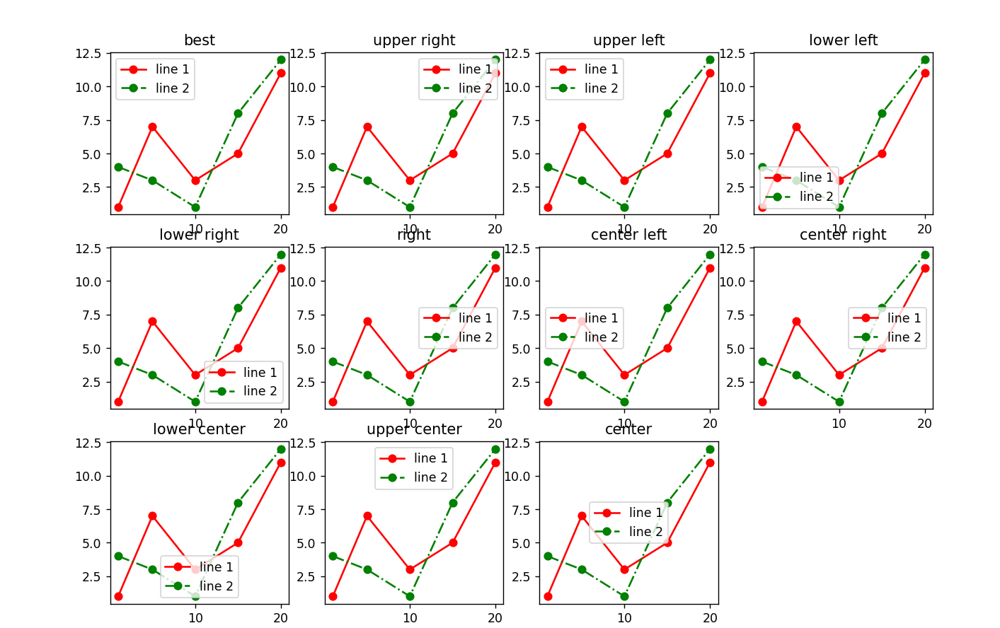

# Лаборатораня работа №5
## Задание
1. Создайте в каталоге для данной ЛР в своём репозитории виртуальное окружение и установите в него matplotlib и numpy. Создайте файл requirements.txt.
2. Откройте книгу [1] и выполните уроки 1-3. Первый урок можно начинать со стр. 8.
3. Выберите одну из неразрывных функции своего варианта из лабораторной работы №2, постройте график этой функции и касательную к ней. Добавьте на график заголовок, подписи осей, легенду, сетку, а также аннотацию к точке касания.
4. Добавьте в корень своего репозитория файл .gitignore отсюда, перед тем как делать очередной коммит.
5. Склонируйте этот репозиторий НЕ в ваш репозиторий, а рядом. Изучите использование этого инструмента и создайте pdf-версию своего отчёта из README.md. Добавьте её в репозиторий.
## Ход работы
1. Cоздал “пустое” виртуальное окружение с помощью команды `python3 -m venv env` 
2. Активировал виртуальное окружение командой `source env/bin/activate`
3. Обновил пакетный менеджер командой `pip install -U pip`
4. Установил необходимые пакеты с помощью команды `pip install 'пакеты'`
5. Перенёс все установленные пакеты в новое окружение: `pip freeze > requirements.txt`
6. Далее на “новом месте” создаЛ пустое окружение, обновил пакетный менеджер и затем выполнил `pip install -r requirements.txt`

## Задания
1. **Урок 1**  
  
  
  
  
  
  
  
2. **Урок 2**  
  
  
  

3. **Урок 3**  
  
  
